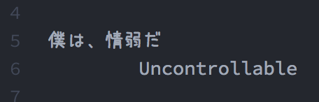

Serika
------

A cute and violent font for programmer like Serika.



## Requirements

- FontForge


## Getting Started
First, you must install requirements.

```
$ brew install fontforge
```

Next, fetch merge scripts.

```
$ git clone https://github.com/pine/Serika.git
$ cd Serika
```

Next, download original fonts.

- SourceCodePro-Regular.ttf
  - https://github.com/adobe-fonts/source-code-pro/releases
- uzura.ttf
  - http://azukifont.com/font/uzura.html
- D2Coding-Ver1.3-20171129.ttf
  - https://github.com/naver/d2codingfont

Finally, run merge script.

```
$ ./Serika.pe
```

Enjoy!


## License

Public Domain
